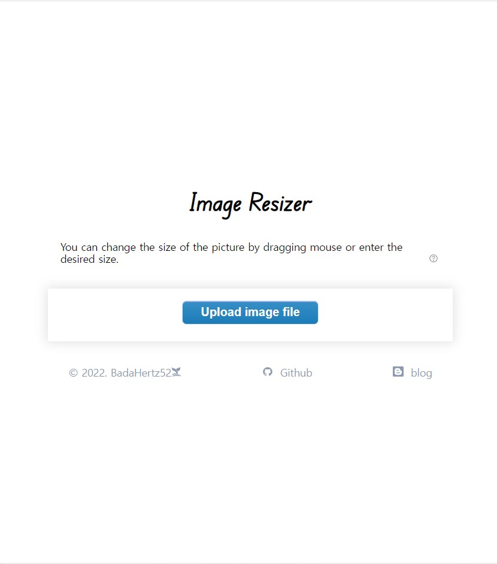
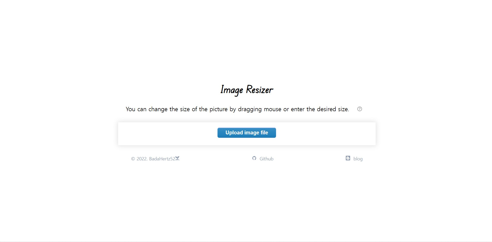
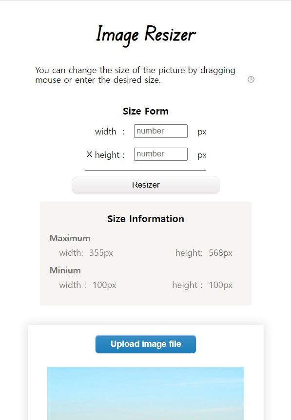
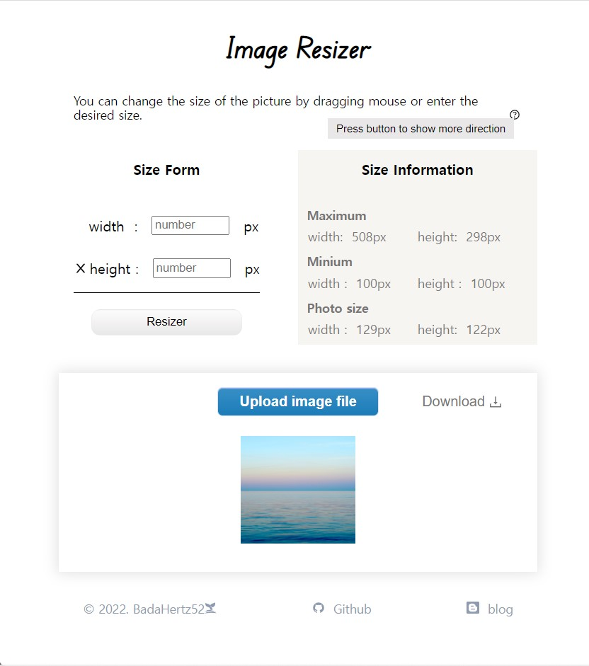
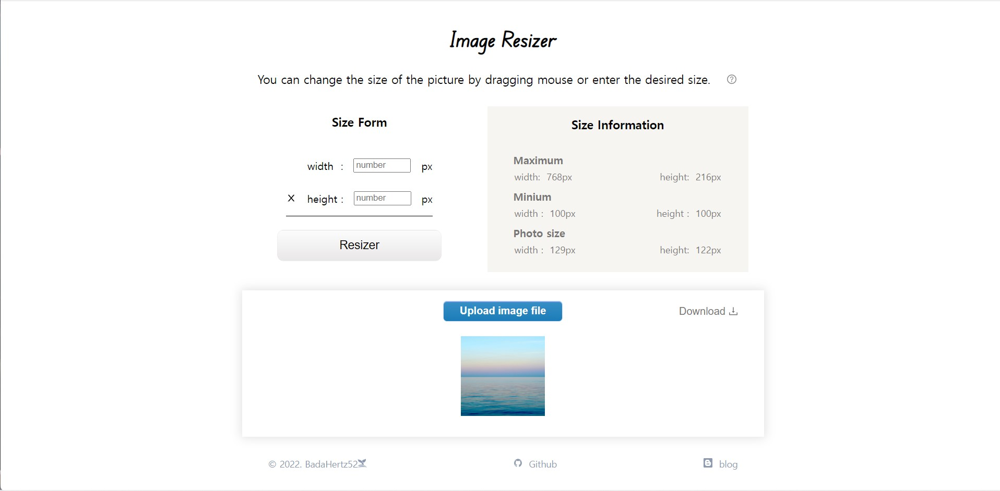
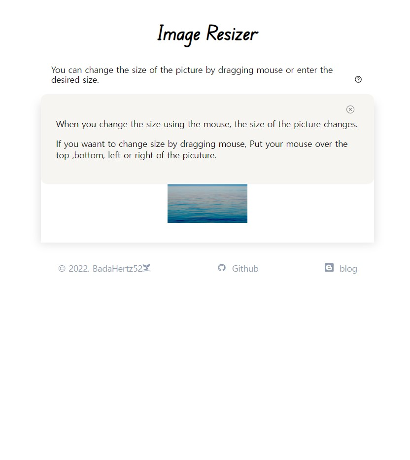
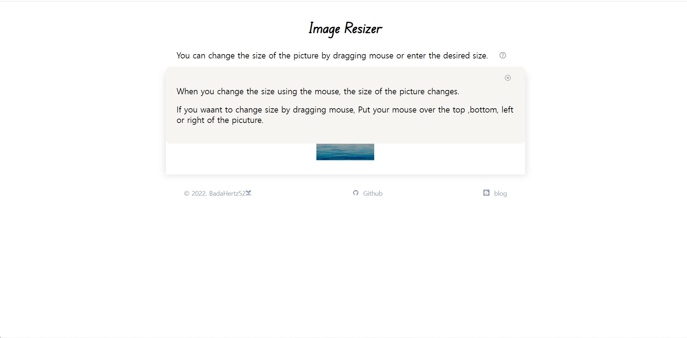
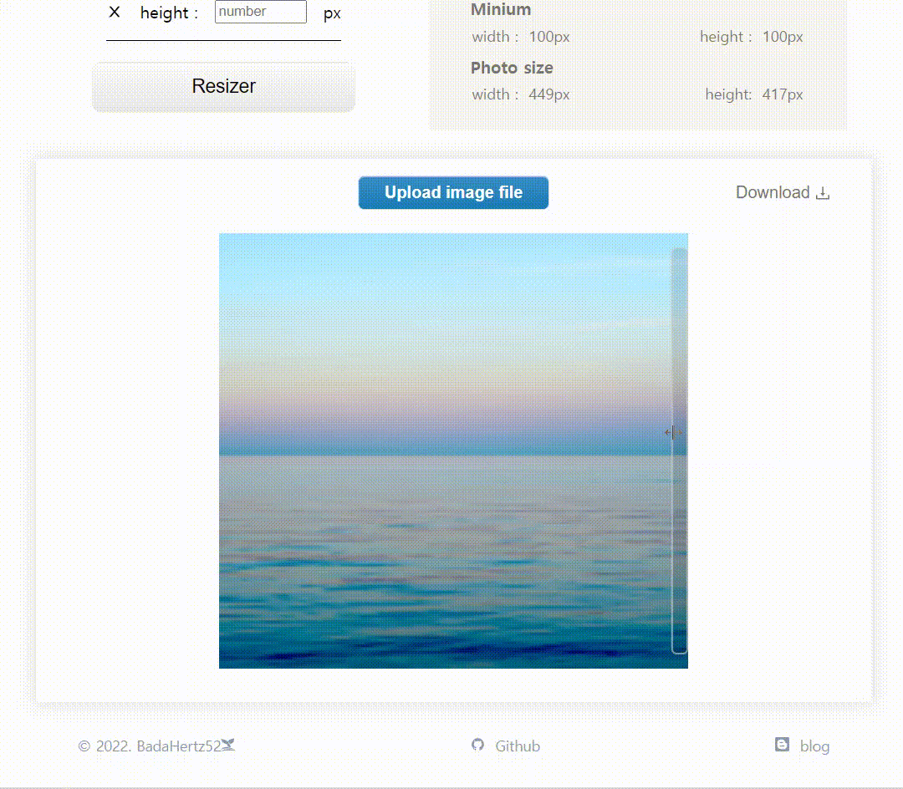
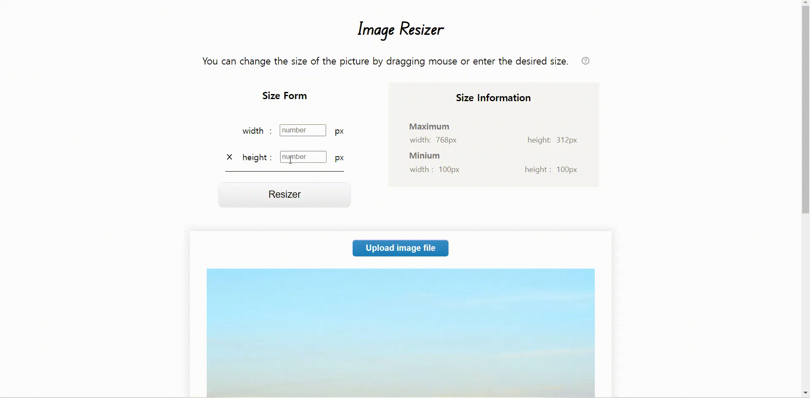

# Image Resizer 
😊[프로젝트 바로가기](https://badahertz52.github.io/imageResizer/)

----------------------
## Index
* <a href='#description'>Description</a>
* <a href="getting_start"> Getting start </a>
  *  Prerequities 
  *  Installing 
* <a href="build_width"> Build width </a>
* <a href="example"> Example of use </a>
  * <a href="layout"> Layout </a>
  * <a href="function"> Function </a>

______________________

## <div id="description" >Description</div>

 마우스의 드래그와 키보드를 통한 수치 입력으로 이미지의 가로, 세로의 길이를 조절하고 조절된 수치의 이미지 파일을 다운받을 수 있는 프로젝트입니다. 

## <div id="gettting_start" >Getting start</div>
### Prerequities
  * Internet Explorer, Opera Android 를 제외한 모든 브라우저에서 사용 가능
  * Node.js 설치 [설치하러가기](https://nodejs.org/ko/download/)
  * npm 설치 
 ```
  $npm install npm@latest -g
```

______________________
### Installing 
* Install react,typescript, react-dom, react-icon,
  ```
  $npx create-react-app@lates react_app_name ---typescript

  $npm install --save react-icon
  ```
* Install tsconfig.json 
  ```
    $npx tsc --init
    //or
    $yarn run tsc --init
  ```
## <div id="build_width" >Build width</div>
* react
* typescript
______________________

## <div id="example" >Example of use</div>
### <div id="layout"> 1. Layout </div>
|page\view|mobile|desktop|
|------|-----|------|
|fist page| ||
|upload page|<div>   </div>||
|more direction| |

### <div id="function"> 2. Function </div> 
#### 1) 사이즈에 대한 정보 제공
  변경 가능한 최대 사이즈와 최소 사이즈, 변경된 사진의 사이즈에 대한 정보를 size information에서 볼 수 있습니다. 

#### 2) 최대 사이즈 변경
  최대 사이즈는 창의 크기에 따라 조절됩니다. 


#### 3) 사이즈 조절 방법: How resize image? 
#### A. 마우스 드래그 (Drag Mouse)
  

  사진의 상하좌우에는 버튼이 존재하고 , 해당 버튼을 누른 후에 드래그 하면 사진의 사이즈를 조절할 수 있습니다.
  <br/>
  하지만, 사진의 사이즈는 size information 에 적힌 최대 사이즈를 넘지 못하고, 최소 사이즈보다 더 작을 수 없습니다. 최대 사이즈를 넘는다면, 해당 사진의 사이즈는 최대 사이즈로 조정되고, 최소 사이즈보다 작게 마우스를 드래그하면 사진의 사이즈는 최소 사이즈로 조정됩니다. 

#### B. 수치 입력 (Enter number)
 size form에 원하는 수치를 입력하면 사진의 사이즈가 변경됩니다. 다만, 입력한 수치가 size information의 최대 사이즈 보다 큰 경우, 최소 사이즈 보다 작은 경우에는 해당 사실을 사용자에게 알려주는 알림창이 열립니다.


#### 4) 입력 가능한 사이즈에 대한 알림 (Notify size limit) 
 

#### 5) 변경 된 사이즈의 이미지 파일 다운로드 (Download image file)
  Download 버튼을 누르면 변경된 사이즈의 이미지 파일을 다운로드 받을 수 있습니다. 


_________________________________

[ 📝 개발 후기 보러 가기 ](https://velog.io/@badahertz52/Image-resizer-by-java-script)